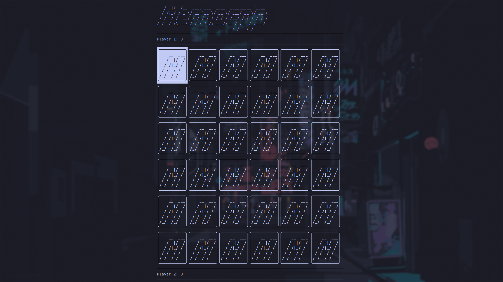

# Memocpp
A simple memory game written in C++.

## Usage
You can use vim keys(h,j,k,l) or arrow keys if you want to move around. To select a card jsut hit enter. The mouse is also supported.

## Build
```sh
git clone https://github.com/sentientbottleofwine/memocpp
cd memocpp/
cmake .
make
```
And then to run it just do:
```
./bin/memocpp
```
